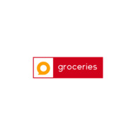

# Groceries App
<div align="center">
  
  
  
</div>

Este proyecto es la segunda continuación de la aplicación de "Groceries" como parte de mi materia "Desarollo Móvil Multiplataforma". Esta práctica consiste en desarollar la API para la aplicación con la capacidad de responder en el estándar JSON siguiento la artquitectura API REST y el patrón de diseño MVC (Model-View-Controller) usando Node.js, Express, EJS, MongoDB Atlas y el ODM Mongoose.


## Stack de Tecnologías

**Client:** EJS, jQuery, jQuery Mobile, TailwindCSS

**Server:** Node, Express, MongoDB Atlas, Mongoose, Nodemon, Morgan, Dotenv


## Ejecutar Localmente

Clonar el proyecto

```bash
  git clone https://github.com/Yayo22124/02-groceries-app.git
```

Ir a la carpeta del proyecto

```bash
  cd 02-groceries-app
```

Instalar dependencias

```bash
  npm install
```

Iniciar servidor de desarrollo

>[!Note]
>Recuerda configurar las variables de entorno para poder ejecutar correctamente la aplicación.

```bash
  npm run dev
```


## Variables de Entorno

Para ejecutar este proyecto es necesario de las siguientes variables de entorno:

`SERVER_PORT`

`CONNECTION_STRING_DB`


## API Reference

#### Get all items

```http
  GET /api/groceries/products/getAll
```


## Autores

- [@Yayo22124](https://www.github.com/Yayo22124)

